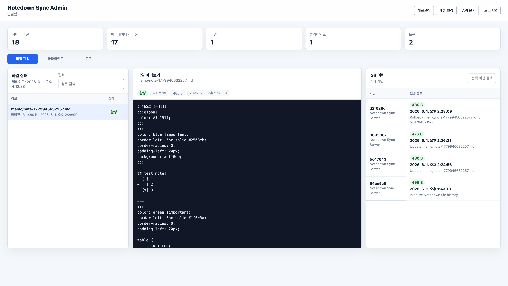

# Notedown Sync Server

Notedown Sync Server is a small Flask service for synchronizing Notedown markdown workspaces, note metadata, and note files across devices.

[Notedown App](https://github.com/ImuruKevol/notedown)

Develop by AI.



---

## 한국어

### 소개

Notedown Sync Server는 Notedown 앱의 `metadata.json`과 마크다운 문서 파일을 여러 기기에서 동기화하기 위한 서버입니다. 서버는 파일별 `serverRevision`, 클라이언트가 마지막으로 확인한 `lastKnownRevision`, 콘텐츠 해시를 비교해 충돌을 감지하고, 자동 덮어쓰기가 위험한 경우 충돌 응답을 반환합니다.

### 주요 기능

- `metadata.json`과 개별 마크다운 파일 동기화
- 파일별 리비전, 콘텐츠 해시, 삭제 tombstone 기반 변경 추적
- `/api/sync/plan` 기반 업로드/다운로드/삭제 계획 생성
- `/api/sync/file` 기반 단일 파일 업로드
- 이전 클라이언트를 위한 `/api/sync` 배치 동기화 호환 API
- 최초 실행 `/setup` 화면 또는 환경변수 기반 관리자 계정 설정
- Bearer 토큰 발급, 사용 기록 저장, 관리자 UI에서 토큰 폐기
- `/admin` 관리 화면에서 서버 상태, 클라이언트, 토큰, 파일, 파일 이력 확인
- `storage/files` 내부 Git 저장소를 이용한 파일별 이력 조회 및 롤백
- `/api/openapi.json`, `/api/docs`, `/docs` OpenAPI/Swagger UI 제공
- CORS 허용 Origin 설정

### 요구사항

- Python 3.9 이상
- Git CLI
- `pip`

### 빠른 시작

```bash
python3 -m venv .venv
source .venv/bin/activate
pip install -r requirements.txt

export NOTE_SYNC_SECRET="replace-with-a-random-secret"
flask --app app run --host 0.0.0.0 --port 5500
```

또는 `PORT` 환경변수를 사용해 직접 실행할 수 있습니다.

```bash
export NOTE_SYNC_SECRET="replace-with-a-random-secret"
export PORT=5500
python app.py
```

처음 실행한 뒤 브라우저에서 `http://localhost:5500/setup`에 접속해 관리자 계정을 만듭니다. 환경변수로 관리자 계정을 지정한 경우에는 `/setup` 대신 `/login`에서 바로 로그인합니다.

### 환경변수

| 변수 | 기본값 | 설명 |
| --- | --- | --- |
| `NOTE_SYNC_STORAGE` | `storage` | 상태 파일, 인증 파일, 토큰 파일, 동기화 파일이 저장되는 디렉터리 |
| `NOTE_SYNC_SECRET` | `dev-secret-change-me` | Flask 세션과 앱 토큰 서명에 쓰는 비밀값. 운영 환경에서는 반드시 변경해야 합니다. |
| `NOTE_SYNC_USERNAME` | 없음 | 환경변수 기반 관리자 ID |
| `NOTE_SYNC_PASSWORD` | 없음 | 환경변수 기반 관리자 비밀번호 |
| `NOTE_SYNC_PASSWORD_HASH` | 없음 | 평문 비밀번호 대신 사용할 Werkzeug 비밀번호 해시 |
| `NOTE_SYNC_AUTH_FILE` | `NOTE_SYNC_STORAGE/auth.json` | `/setup`에서 생성되는 관리자 인증 파일 경로 |
| `NOTE_SYNC_CORS_ORIGIN` | `*` | API CORS `Access-Control-Allow-Origin` 값 |
| `PORT` | `5500` | `python app.py`로 실행할 때 사용할 포트 |

`NOTE_SYNC_USERNAME`과 `NOTE_SYNC_PASSWORD` 또는 `NOTE_SYNC_PASSWORD_HASH`를 함께 지정하면 파일 기반 `/setup` 없이 환경변수 계정으로 동작합니다. 이 경우 관리자 UI에서 계정 정보를 수정할 수 없습니다.

비밀번호 해시는 아래처럼 생성할 수 있습니다.

```bash
python -c "from werkzeug.security import generate_password_hash; print(generate_password_hash('your-password'))"
```

### 저장소 구조

기본 저장 디렉터리는 `storage/`입니다.

- `storage/state.json`: 서버 리비전, 파일 manifest, 클라이언트 상태
- `storage/metadata.json`: 서버가 보유한 Notedown 메타데이터
- `storage/files/`: 동기화된 마크다운 파일과 내부 Git 저장소
- `storage/auth.json`: `/setup`에서 만든 파일 기반 관리자 계정
- `storage/tokens.json`: 발급된 앱 토큰과 최근 사용 정보

`storage/files`는 서버 시작 시 Git 저장소로 초기화됩니다. 파일 저장, 삭제, 롤백은 Git 커밋으로 기록됩니다.

### 관리 화면

- `/setup`: 최초 관리자 계정 생성
- `/login`: 관리자 로그인
- `/admin`: 서버 상태, 클라이언트, 토큰, 파일, 파일 이력, 롤백 관리
- `/logout`: 관리자 세션 종료

### API 개요

인증이 필요 없는 API:

- `GET /api/health`: 서버 상태 확인
- `GET /api/openapi.json`, `GET /openapi.json`: OpenAPI 3.1 문서
- `GET /api/docs`, `GET /docs`: Swagger UI
- `GET /api/setup/status`: 초기 관리자 계정 설정 여부 확인
- `POST /api/setup`: 최초 관리자 계정 생성
- `POST /api/login`: 관리자 인증 및 Bearer 토큰 발급
- `POST /api/logout`: 관리자 세션 종료

Bearer 토큰 또는 관리자 세션이 필요한 API:

- `GET /api/manifest`: 서버 리비전, 파일 manifest, 클라이언트 상태 조회
- `GET /api/files/{relativePath}`: 서버 파일 다운로드
- `POST /api/sync/plan`: 동기화 계획 생성
- `POST /api/sync/file`: 단일 파일 업로드 또는 삭제 반영
- `POST /api/sync`: 이전 클라이언트용 배치 동기화
- `GET /api/admin/account`: 관리자 계정 정보 조회
- `POST /api/admin/account`: 파일 기반 관리자 계정 수정
- `GET /api/admin/tokens`: 발급 토큰 목록 조회
- `DELETE /api/admin/tokens/{tokenId}`: 토큰 폐기
- `GET /api/admin/files/{relativePath}/history`: 파일 Git 이력 조회
- `GET /api/admin/files/{relativePath}/history/{commit}`: 특정 커밋의 파일 내용 조회
- `POST /api/admin/files/{relativePath}/rollback`: 파일을 특정 커밋 상태로 롤백

인증 토큰은 로그인 응답의 `accessToken` 값을 사용합니다.

```http
Authorization: Bearer <accessToken>
```

### 권장 동기화 흐름

1. 클라이언트가 `/api/login`으로 로그인하고 `accessToken`을 저장합니다.
2. 전체 동기화가 필요하면 `/api/sync/plan`에 로컬 `metadata.json`과 `knownFiles`를 보냅니다.
   새 기기처럼 서버 파일을 아직 내려받지 않은 상태에서는 `knownFiles`를 비우거나
   `deleted`를 생략하세요. 서버는 metadata에 없다는 이유만으로 서버 파일을 삭제하지 않습니다.
3. 응답의 `plan.uploadFiles`는 `/api/sync/file`로 업로드합니다.
4. 응답의 `plan.downloadFiles`는 `/api/files/{relativePath}`로 다운로드합니다.
5. 응답의 `plan.deleteServerFiles`는 서버 삭제로, `plan.deleteLocalFiles`는 로컬 삭제로 반영합니다.
   서버 삭제를 계획으로 요청하려면 해당 `knownFiles` 항목에 `deleted: true`와
   `lastKnownRevision`을 명시하거나 `/api/sync/file`에 `deleted: true`를 보내세요.
6. 각 처리 후 응답의 `manifest.serverRevision`과 파일별 `revision`을 로컬 동기화 상태에 저장합니다.
7. `plan.conflicts`가 있으면 자동 덮어쓰기 대신 사용자 선택 또는 병합 UI를 거칩니다.
8. 파일 저장 이벤트가 발생하면 전체 동기화를 기다리지 않고 `/api/sync/file`로 해당 파일만 업로드할 수 있습니다.

### 예시 요청

로그인:

```json
{
  "username": "admin",
  "password": "change-this-password"
}
```

동기화 계획:

```json
{
  "clientId": "macbook-1",
  "baseRevision": 0,
  "clientInfo": {
    "hostname": "macbook-pro",
    "platform": "macOS",
    "appVersion": "1.2.3"
  },
  "metadata": {
    "lastKnownRevision": 0,
    "body": {
      "version": 1,
      "workspaces": [],
      "notes": []
    }
  },
  "knownFiles": []
}
```

단일 파일 업로드:

```json
{
  "clientId": "macbook-1",
  "relativePath": "memo/note.md",
  "lastKnownRevision": 0,
  "updatedAtMs": 1780030055707,
  "contentEncoding": "utf-8",
  "content": "# 새 노트\n",
  "workspace": {
    "id": "memo",
    "name": "memo"
  },
  "note": {
    "id": "note-1",
    "title": "새 노트",
    "workspace": "memo",
    "relativePath": "memo/note.md",
    "updatedAtMs": 1780030055707
  }
}
```

파일 삭제:

```json
{
  "clientId": "macbook-1",
  "relativePath": "memo/old.md",
  "lastKnownRevision": 3,
  "deleted": true,
  "updatedAtMs": 1780030055707
}
```

계획에서 서버 삭제를 명시하는 `knownFiles` tombstone:

```json
{
  "relativePath": "memo/old.md",
  "lastKnownRevision": 3,
  "deleted": true
}
```

### 테스트

```bash
python -m unittest discover -s tests
```

### 보안 메모

- 운영 환경에서는 `NOTE_SYNC_SECRET`을 충분히 긴 랜덤 값으로 설정하세요.
- 가능하면 HTTPS 뒤에서 실행하고, 리버스 프록시에서 접근 제어를 적용하세요.
- `NOTE_SYNC_CORS_ORIGIN=*`은 개발에는 편리하지만 운영에서는 신뢰할 수 있는 Origin으로 제한하는 것이 좋습니다.
- `storage/`에는 인증 정보, 토큰, 문서 파일이 포함되므로 백업과 권한 관리를 신중히 설정하세요.

### 라이선스

MIT License. 자세한 내용은 [LICENSE](LICENSE)를 확인하세요.

---

## English

### Overview

Notedown Sync Server is a Flask-based synchronization service for Notedown's `metadata.json` and markdown note files. It compares each file's `serverRevision`, the client's `lastKnownRevision`, and content hashes to detect conflicts before overwriting remote or local changes.

### Features

- Synchronizes Notedown metadata and markdown files
- Tracks per-file revisions, content hashes, and deletion tombstones
- Builds upload, download, and delete plans through `/api/sync/plan`
- Accepts single-file uploads and deletes through `/api/sync/file`
- Keeps the legacy batch `/api/sync` endpoint for older clients
- Supports first-run `/setup` credentials or environment-managed admin credentials
- Issues Bearer tokens and lets admins revoke tokens from the web UI
- Provides an `/admin` UI for server status, clients, tokens, files, history, and rollback
- Stores synced files in an internal Git repository under `storage/files`
- Exposes OpenAPI JSON and Swagger UI at `/api/openapi.json`, `/api/docs`, and `/docs`
- Provides configurable CORS origin support

### Requirements

- Python 3.9 or newer
- Git CLI
- `pip`

### Quick Start

```bash
python3 -m venv .venv
source .venv/bin/activate
pip install -r requirements.txt

export NOTE_SYNC_SECRET="replace-with-a-random-secret"
flask --app app run --host 0.0.0.0 --port 5500
```

You can also run the app directly with `PORT`.

```bash
export NOTE_SYNC_SECRET="replace-with-a-random-secret"
export PORT=5500
python app.py
```

After the first start, open `http://localhost:5500/setup` and create the admin account. If admin credentials are configured through environment variables, use `/login` instead.

### Environment Variables

| Variable | Default | Description |
| --- | --- | --- |
| `NOTE_SYNC_STORAGE` | `storage` | Directory for state, auth, tokens, and synced files |
| `NOTE_SYNC_SECRET` | `dev-secret-change-me` | Secret for Flask sessions and signed app tokens. Change this in production. |
| `NOTE_SYNC_USERNAME` | none | Environment-managed admin username |
| `NOTE_SYNC_PASSWORD` | none | Environment-managed admin password |
| `NOTE_SYNC_PASSWORD_HASH` | none | Werkzeug password hash to use instead of a plain password |
| `NOTE_SYNC_AUTH_FILE` | `NOTE_SYNC_STORAGE/auth.json` | Path for file-backed admin credentials created by `/setup` |
| `NOTE_SYNC_CORS_ORIGIN` | `*` | API CORS `Access-Control-Allow-Origin` value |
| `PORT` | `5500` | Port used by `python app.py` |

Set `NOTE_SYNC_USERNAME` with either `NOTE_SYNC_PASSWORD` or `NOTE_SYNC_PASSWORD_HASH` to skip file-backed setup. Environment-managed credentials cannot be edited from the admin UI.

Generate a password hash with:

```bash
python -c "from werkzeug.security import generate_password_hash; print(generate_password_hash('your-password'))"
```

### Storage Layout

The default storage directory is `storage/`.

- `storage/state.json`: server revision, file manifest, and client state
- `storage/metadata.json`: server-side Notedown metadata
- `storage/files/`: synchronized markdown files and the internal Git repository
- `storage/auth.json`: file-backed admin credentials created by `/setup`
- `storage/tokens.json`: issued app tokens and last-used metadata

`storage/files` is initialized as a Git repository when the server starts. File saves, deletes, and rollbacks are recorded as commits.

### Admin UI

- `/setup`: create the first admin account
- `/login`: admin login
- `/admin`: manage server status, clients, tokens, files, history, and rollback
- `/logout`: clear the admin session

### API Overview

Public endpoints:

- `GET /api/health`: health check
- `GET /api/openapi.json`, `GET /openapi.json`: OpenAPI 3.1 document
- `GET /api/docs`, `GET /docs`: Swagger UI
- `GET /api/setup/status`: setup status
- `POST /api/setup`: create the first admin account
- `POST /api/login`: authenticate and issue a Bearer token
- `POST /api/logout`: clear the admin session

Authenticated endpoints:

- `GET /api/manifest`: server revision, file manifest, and client status
- `GET /api/files/{relativePath}`: download a server file
- `POST /api/sync/plan`: create a sync plan
- `POST /api/sync/file`: upload or delete a single file
- `POST /api/sync`: legacy batch sync
- `GET /api/admin/account`: read admin account metadata
- `POST /api/admin/account`: update file-backed admin credentials
- `GET /api/admin/tokens`: list issued tokens
- `DELETE /api/admin/tokens/{tokenId}`: revoke a token
- `GET /api/admin/files/{relativePath}/history`: list Git history for a file
- `GET /api/admin/files/{relativePath}/history/{commit}`: read a file at a specific commit
- `POST /api/admin/files/{relativePath}/rollback`: roll back a file to a commit

Use the `accessToken` from `/api/login` as a Bearer token.

```http
Authorization: Bearer <accessToken>
```

### Recommended Sync Flow

1. Log in with `/api/login` and store the `accessToken`.
2. For a full sync, send local `metadata.json` and `knownFiles` to `/api/sync/plan`.
   On a new device that has not downloaded server files yet, leave `knownFiles`
   empty or omit `deleted`; missing client metadata is not treated as a server
   delete.
3. Upload `plan.uploadFiles` with `/api/sync/file`.
4. Download `plan.downloadFiles` with `/api/files/{relativePath}`.
5. Apply `plan.deleteServerFiles` on the server side and `plan.deleteLocalFiles` locally.
   To request a server delete from planning, include the path in `knownFiles`
   with `deleted: true` and `lastKnownRevision`, or call `/api/sync/file` with
   `deleted: true`.
6. Store `manifest.serverRevision` and each file `revision` in the client's sync state.
7. If `plan.conflicts` is not empty, ask the user to choose or merge instead of overwriting automatically.
8. On file-save events, upload the changed file directly with `/api/sync/file`.

### Example Requests

Login:

```json
{
  "username": "admin",
  "password": "change-this-password"
}
```

Sync plan:

```json
{
  "clientId": "macbook-1",
  "baseRevision": 0,
  "clientInfo": {
    "hostname": "macbook-pro",
    "platform": "macOS",
    "appVersion": "1.2.3"
  },
  "metadata": {
    "lastKnownRevision": 0,
    "body": {
      "version": 1,
      "workspaces": [],
      "notes": []
    }
  },
  "knownFiles": []
}
```

Single-file upload:

```json
{
  "clientId": "macbook-1",
  "relativePath": "memo/note.md",
  "lastKnownRevision": 0,
  "updatedAtMs": 1780030055707,
  "contentEncoding": "utf-8",
  "content": "# New note\n",
  "workspace": {
    "id": "memo",
    "name": "memo"
  },
  "note": {
    "id": "note-1",
    "title": "New note",
    "workspace": "memo",
    "relativePath": "memo/note.md",
    "updatedAtMs": 1780030055707
  }
}
```

File delete:

```json
{
  "clientId": "macbook-1",
  "relativePath": "memo/old.md",
  "lastKnownRevision": 3,
  "deleted": true,
  "updatedAtMs": 1780030055707
}
```

`knownFiles` tombstone for planned server delete:

```json
{
  "relativePath": "memo/old.md",
  "lastKnownRevision": 3,
  "deleted": true
}
```

### Tests

```bash
python -m unittest discover -s tests
```

### Security Notes

- Set `NOTE_SYNC_SECRET` to a long random value in production.
- Run the service behind HTTPS and apply access control at the reverse proxy when possible.
- `NOTE_SYNC_CORS_ORIGIN=*` is convenient for development, but production deployments should restrict it to trusted origins.
- `storage/` contains credentials, tokens, and note files. Configure backups and filesystem permissions carefully.

### License

MIT License. See [LICENSE](LICENSE) for details.
